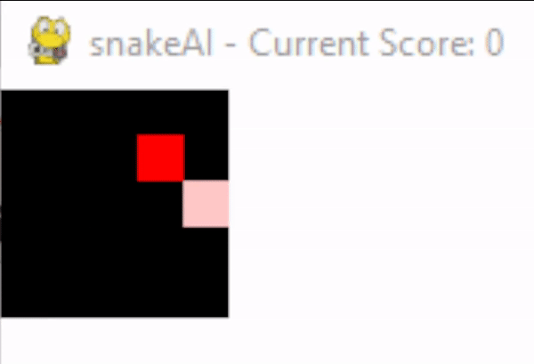
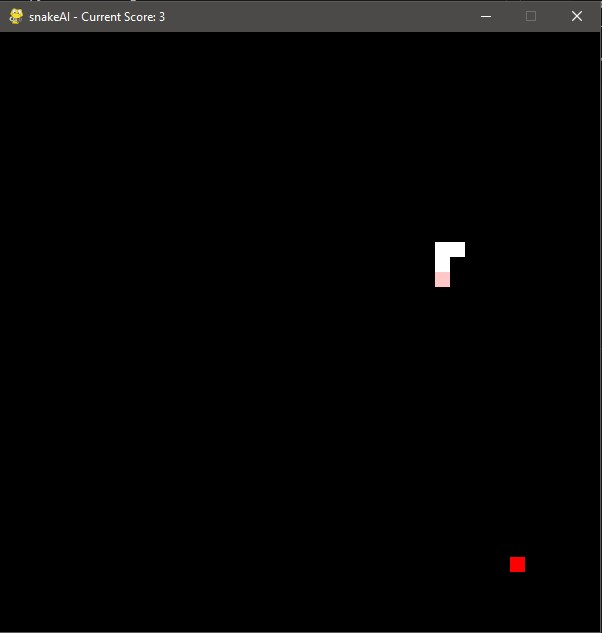

# snakeAI
Small repo for a first test of reinforcement learning using Snake as an example.  

`snake.py` contains the game logic and the pygame-renderer. Also contains function to export board state as numpy.  
`test_draw.py` starts a little game session to play snake with the arrow keys.  
`model.py` contains the model definition.  
`train.py` contains the train logic



## Env details
```
conda create -n snakeai
conda activate snakeai
conda install numpy tqdm matplotlib
conda install pytorch torchvision torchaudio cudatoolkit=11.3 -c pytorch #change version if needed
pip install pygame

or install using requirements.txt
```

##  Snake Game Demo
